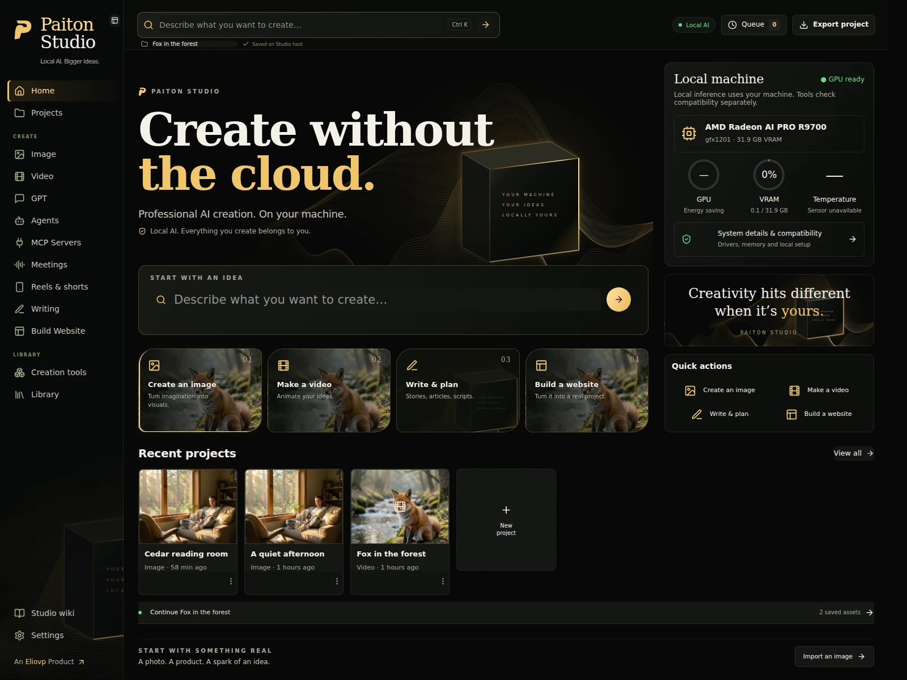
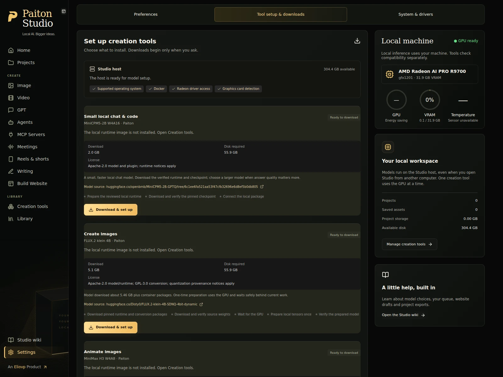
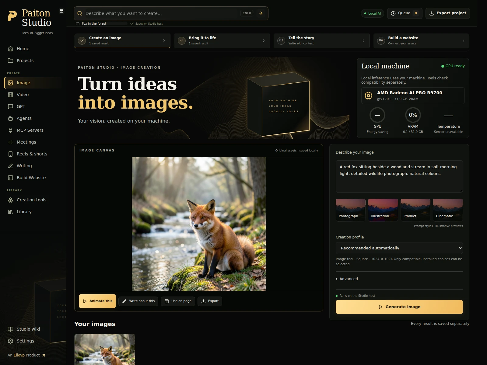
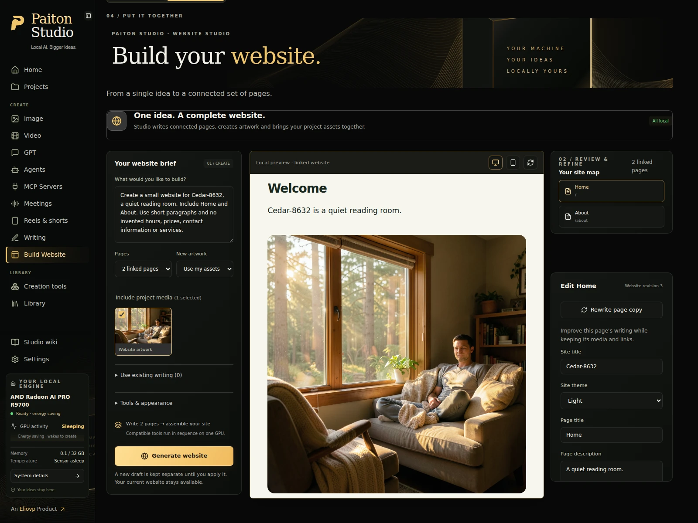

<div align="center">

# Paiton Studio

**[An Eliovp Product](https://eliovp.com)**

### Create without the cloud.

**Images. Video. Writing. Websites. Your Radeon.**

A creative workspace powered by optimized Paiton models, running on your own computer.

[Get started](#install-on-linux) · [Your first project](#your-first-project) · [Choose your tools](#choose-your-tools) · [Get help](#troubleshooting)

**Linux preview** &nbsp; / &nbsp; **Local inference** &nbsp; / &nbsp; **Built around AMD Radeon**

</div>



Turn one idea into an image, animate that exact image, write its story, and build a linked website around your real assets. Everything stays together in a project you can reopen and export.

Your prompts, documents and generation run on the **Studio host**—the computer with your GPU. No hosted inference fallback, required AI subscription or external inference API. Installing tools needs internet access; creating with prepared tools runs locally.

## Meet your studio

| Create | What you can do |
| --- | --- |
| **Image** | Generate artwork locally, browse your creations, and send a selected image to Video. |
| **Video** | Animate your exact source image with a supported image-to-video tool, or start from text. |
| **GPT** | Chat, work with uploaded documents, reason through ideas, and generate project images in the conversation. |
| **Writing** | Draft captions, articles and product stories with selected project context. |
| **Build Website** | Create linked static pages with copy and artwork. Regenerate one page’s text or one section’s image, review the result, then apply it. |
| **Agents & MCP Servers** | Give a local assistant a purpose and selected context. Connect supported applications to its local inference through MCP. |
| **Meetings** | Transcribe recordings and review speaker-labelled text and summaries. Additional setup is required. |

One queue manages the GPU. Studio shows preparation, loading, generation and recovery states, while your project stays available to browse. Compatible text models can remain loaded for faster follow-up requests.

## Before you install

**Paiton Studio has been extensively tested on the [AMD Radeon™ AI PRO R9700](https://www.amd.com/en/products/graphics/workstations/radeon-ai-pro/ai-9000-series/amd-radeon-ai-pro-r9700.html), with 32 GB of graphics memory and RDNA™ 4 architecture.** Real hardware checks cover image generation, image-to-video, local writing, website generation, individual output regeneration and text-runtime reuse. Image, video and writing checks were also repeated after the test system’s ROCm upgrade.

This is a **Linux preview**, with Ubuntu 24.04 as the tested installation base. Windows support is planned; there is no qualified Windows installer or native Windows runtime path yet. You can already use a browser on Windows to connect to a Linux Studio host on your trusted network.

| You need | What to check |
| --- | --- |
| **A supported GPU** | The current model packages require one Radeon AI PRO R9700. Other RDNA4 cards, older Radeon generations, NVIDIA, Intel and CPU-only inference are not qualified in this release. |
| **Working GPU software** | The AMD driver and ROCm must detect your card, with GPU access available to your Linux user. Studio checks these requirements. |
| **Docker Engine** | Running locally on the Studio host and accessible to your user without `sudo`. Model packages use containers—self-contained runtime environments. Remote Docker engines and Docker Desktop are not supported by this Linux installation path. |
| **Python and Node.js** | Use **Python 3.12** and **Node.js 22 LTS**, including npm. These are the versions used for validation. |
| **Disk space** | Use an SSD. The current installers ask for roughly **45–100 GB free per tool**, including preparation space; the collection can need substantially more. Check each tool’s estimate before downloading. |
| **System memory** | Larger models need substantial RAM while loading. Our test host has 16 GB of system RAM; this can make preparation slow. More RAM may help disk caching, but does not replace graphics memory. |

> **Have a 16 GB GPU?** A small model download does not mean its current runtime supports your card. Studio checks both GPU identity and memory, and disables incompatible generation profiles. Broader GPU support will be added through qualified Paiton packages.

## Install on Linux

You will use the terminal for this initial setup. After that, projects, model downloads and creation happen in your browser.

### 1. Prepare your GPU and Docker

If this computer already runs Paiton packages successfully, keep its working setup and continue to step 2.

For a new machine, use [AMD’s ROCm installation documentation](https://rocm.docs.amd.com/projects/install-on-linux/en/latest/) or review [JoergR75’s AMD TheRock / ROCm deployment guide](https://github.com/JoergR75/amd-therock-7.15-rocm-10-0-0-pytorch-docker-cdna-rdna-automated-deployment). Joerg’s guide covers the GPU software stack and Docker setup for Ubuntu 24.04/26.04.

> **Read before running a driver installer.** Joerg’s script can remove existing ROCm, PyTorch and Docker installations, change system permissions, and reboot the computer. Back up your machine and finish other GPU work first. Its wider architecture support does not qualify every GPU for Paiton’s model packages. Studio never runs this installer automatically.

If Docker is still missing, follow the [Docker Engine Ubuntu instructions](https://docs.docker.com/engine/install/ubuntu/). Follow its [Linux post-installation steps](https://docs.docker.com/engine/install/linux-postinstall/) to allow your user to access Docker; Docker group membership grants powerful host access, so use a trusted account.

Sign out and back in after changing user permissions, then open a terminal and run:

```bash
docker info
rocminfo
```

Docker should report a running server. ROCm should list your AMD GPU. If either fails, resolve the driver or permission issue before downloading models. You can still open Studio to view its system guidance.

### 2. Install the small application prerequisites

On Ubuntu 24.04:

```bash
sudo apt update
sudo apt install python3 python3-venv python3-pip
```

Install **Node.js 22 LTS** using the [official Node.js download instructions](https://nodejs.org/en/download). Then check:

```bash
python3 --version
node --version
npm --version
```

Use Python `3.12.x` and Node `v22.x` for the tested path. npm comes with Node.js.

### 3. Open the Studio source folder

Extract the Paiton Studio source ZIP into a writable folder you want to keep. Open that folder in your file manager and choose **Open in Terminal**. You should see `README.md`, `requirements.txt` and `package.json` in the folder.

Run these commands, one line at a time:

```bash
python3 -m venv .venv
.venv/bin/python -m pip install -r requirements.txt
npm ci
npm run build
```

Wait for each command to finish successfully before continuing. These commands install the application and build its interface. **They do not download the AI models.**

### 4. Start Studio

From the same folder:

```bash
bash run.sh
```

Keep this terminal open. When startup completes, open **[http://localhost:8877](http://localhost:8877)** in your browser.

On another computer on the same trusted network, open `http://YOUR-STUDIO-HOST-IP:8877`, replacing `YOUR-STUDIO-HOST-IP` with the Linux computer’s LAN address. The Linux host performs the inference; your browser computer does not need a supported GPU.

Studio listens on `0.0.0.0:8877` by default. It is a shared workspace without separate user accounts, so everyone who can access it can access the workspace. Keep it on a trusted LAN; do not port-forward it onto the internet. [Local-only binding and other settings →](USER_GUIDE.md#network-access)

### 5. Download your first creation tool

1. Open **Settings → System & drivers**. Resolve any reported compatibility or access problems.
2. Open **Settings → Tool setup & downloads**.
3. Choose a tool, read its memory, disk-space and license information, then select **Download & set up**.
4. Leave Studio running while it downloads, verifies and prepares the package. You can browse around while it works.
5. Wait for **Ready to create** before submitting your first request.

For a quick first conversation, choose **Small local chat & code — MiniCPM5-2B**. For your first artwork, choose **Create images — FLUX.2 klein**. Add video and writing tools when you need them; you do not have to install everything.

**First setup can take a while.** Downloads can be tens of gigabytes, and some tools need a one-time build or GPU preparation. “Downloaded”, “prepared” and “loaded on the GPU” are different steps. The interface shows which step is running.

No configuration file is needed for this guided path. Studio writes the settings for the packages it installs. If you already have prepared Paiton packages, see [connect existing models](USER_GUIDE.md#connect-existing-models).



## Your first project

Try a small creative project called **A quiet place**. Install the tools needed for each step first.

| Step | Try this |
| --- | --- |
| **1 · Create an image** | Make a new project. In **Image**, enter: “A small timber cabin beside a still alpine lake at dusk, warm window light, distant mountains, cinematic photography.” Generate it and select the result you want to keep. |
| **2 · Make it move** | Send that image to **Video**, choose an image-to-video profile, and describe the motion: “A slow camera push toward the cabin. Gentle ripples on the lake.” Your selected image becomes the actual input. |
| **3 · Tell its story** | In **Writing**, ask for a short caption or article. Supply the facts you want included and choose the relevant project context. Review the draft and save your edits. |
| **4 · Build a website** | Open **Build Website**, select your real media and writing, and ask for a small Home and About site. Review its linked pages in the preview. |
| **5 · Keep it yours** | Use **Export project** to save the available page, media and text outputs. Your editable project also stays on the host; return to **Projects** to reopen it later. |

Project context helps the writing model use your notes and selected text. It does not imply that every model can visually understand an image or video.



### Change one thing without starting over

In **Build Website**, regenerate one page’s copy or one section’s artwork. Studio queues just that output and opens a review before you apply it. The other pages and original assets stay available. If a larger website workflow fails partway through, **Retry unfinished steps** reuses completed work.



*These are screenshots of the running application with example projects and real locally generated outputs. Model availability and hardware readings reflect the capture host; results and timings vary.*

## Choose your tools

You choose a creative task first. Studio offers installed models compatible with that task and the detected hardware. Set defaults in **Settings → Preferences → Default creation tools**, then select **Save preferences**. A project can retain its own choice.

| Tool | Best starting use | Keep in mind |
| --- | --- | --- |
| **MiniCPM5-2B W4A16** | Faster GPT conversations and lightweight code help | The small option for less waiting. Expect weaker reasoning, factual reliability and complex coding than larger models. It is not currently a Writing or Website planner. |
| **GPT-OSS-20B** | GPT, reasoning, code help and writing | A larger download and runtime. Deeper reasoning can take longer. |
| **Qwen3.8 27B Qronos** | Writing and website planning | A larger model with potentially long cold starts. Its ready runtime can be reused between writing and website requests. |
| **Qwen3-Coder 30B A3B** | Alternative writing and website planning | Use the compatible profiles offered by Studio. |
| **FLUX.2 klein 4B** | Image creation and website artwork | Initial setup prepares the image package locally. |
| **MiniMax H3** | Image-to-video, including supported audio output | Uses most of the test card’s graphics memory. Duration, size and audio behavior depend on the selected profile. |
| **Wan2.2 TI2V-5B** | Image-to-video or text-to-video | Produces silent video. |
| **FastWan FullAttn 5B** | Faster text-to-video | Produces silent video; this integration does not accept a source image. |

The available sizes, durations and quality options come from the supported package profiles. Studio does not silently substitute another model or lower your chosen quality. Model files and runtime packages come from the [Paiton runtime collection](https://github.com/Eliovp-BV/paiton-vllm-plugin), under their own terms.

## Understand the wait

**Your GPU does not need to hold every model at once.** Studio queues work and switches tools when necessary.

| What you see | What is happening |
| --- | --- |
| **Waiting in your queue** | Another request or preparation task is using the GPU. Your request is saved. |
| **Preparing / loading model** | Studio is starting the runtime, preparing caches or loading model data. The first load can take several minutes; larger models on a memory-constrained host can take over ten minutes. |
| **Generating** | The local model is creating your output. Hardware activity and supported progress reports update in the interface. |
| **Ready / completed** | Your result is saved on the host and available in its project. |

For quicker follow-ups, finish a group of requests with one tool before switching. In **Settings → Preferences → Model loading & switching**, choose how long supported text models stay ready: **2, 5 or 15 minutes**. An active GPT workspace extends retention, while another queued tool can still reclaim the GPU.

Files and supported runtime caches remain on disk, but returning to a released model may require another load. Image and Video currently load for each request. RAM caching cannot guarantee instant switching or make a model fit into insufficient graphics memory.

You can continue browsing while work runs. Closing the browser does not stop the host, but closing its terminal, stopping Studio or putting the host to sleep interrupts background work. [Recovery and faster repeat requests →](USER_GUIDE.md#queue-and-model-memory)

## Troubleshooting

| If you see this | Try this |
| --- | --- |
| **GPU not detected / system setup needed** | Open **Settings → System & drivers**. Check the driver, GPU permissions and local Docker Engine. Reopen your session after permission changes. |
| **Installed, but incompatible GPU** | Downloaded files do not qualify the card. Read the compatibility message; a different GPU or insufficient VRAM can block generation. |
| **No tools available** | Open **Tool setup & downloads**, install a compatible tool, and wait for preparation to finish. |
| **Not enough disk space** | Check both the Studio data location and Docker storage. Model weights, extracted containers and temporary preparation files all use space. |
| **Download failed** | Check connectivity and available disk space, then retry setup. Do not delete your project data to fix a model download. |
| **Model loading seems slow** | Keep the host running and check the queue. First use and larger model switches can take several minutes. Choose MiniCPM for lighter chat tasks when its quality tradeoff is acceptable. |
| **Browser cannot connect** | Keep the launch terminal open, confirm the host address and port, and check the host firewall. Use the host’s LAN address from another computer, not `localhost`. |
| **Meeting microphone unavailable** | Browser recording needs `localhost` or trusted HTTPS. On plain LAN HTTP, import a recording instead. |

For terminal setup errors, updates, backups, connected applications and meeting preparation, see the **[user guide](USER_GUIDE.md)**. The in-app **Wiki** also works locally.

## Your work belongs on your machine

Projects, media and local history live in `.data/` by default. Back up the complete data folder and `config.local.json`, if present, with Studio stopped. Keep configured external model folders separately. An exported website or media ZIP is useful for sharing; it is not a complete backup of the editable workspace.

The current release focuses on one GPU and a trusted local workspace. Websites are static exports; agents perform bounded local tasks. Meetings require additional package preparation, and Mail MCP creates reviewed drafts rather than directly sending mail on Linux. [Advanced capabilities and limits →](USER_GUIDE.md)

## Credits and licensing

Paiton Studio uses the [Paiton runtime packages](https://github.com/Eliovp-BV/paiton-vllm-plugin). The proprietary Paiton compiler and model weights are not included in this repository.

Third-party components retain their licenses, including the AGPL-3.0-or-later components used by Mail MCP. **A license for the complete Studio application has not yet been assigned.** See [NOTICE.md](NOTICE.md) for the current licensing status and attribution. Model terms apply separately.

<div align="center">

**Local AI. Bigger ideas.**

Built locally. Created by you.

[An Eliovp Product](https://eliovp.com)

</div>
